# The Dunder Mifflin Quiz

## Introduction

* The Dunder Mifflin quiz is inspired by a very popular American TV show such as The Office, the quiz asks a range of trivia questions derived from the show. 
[View live project here]()
* As the game was developed in Python for use in the terminal, it utilizes the Code Institute Python Template to generate a "terminal" onto the page, making it available within a web browser.
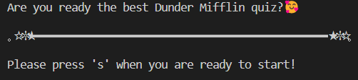

## User Experience

### User Stories

#### First Time Visitor Goals
--- 
 1. As a first time visitor, I want the game to be clear.
 2. As a first time visitor, I want to easily navigate the game.
 3. As a first time visitor, I want the game to be as aesthetically pleasing as possible given the limited resources.

#### Returning Visitor Goals
---
 1. As a returning visitor, I want to enjoy the game.
 2. As a returning visitor, I want to play and show friends.
 3. As a returning visitor, I want to have a range of questions.

#### Frequent Visitor Goals
---
 1. As a frequent visitor, I want to be able to play with different questions.
 2. As a frequent visitor, I want the game to be consistent.
 3. As a frequent visitor, I want to enjoy playing!

#### Organization Goals
---
 1. As an organization we want to promote and make the game more popular.
 2. As an organization we want to have a base of people who play for when we realease new games.
 3. As an organization we want to be easily accessible to interested parties.

### Flow Chart
---
* The flow chart is made to demonstrate how the games functionality was planned. However since, after the game has been played it goes back to the inital start.
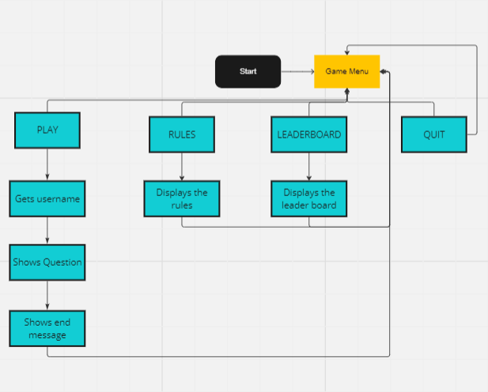

### Languages Used

* [HTML](https://en.wikipedia.org/wiki/HTML)
* [CSS](https://en.wikipedia.org/wiki/CSS)
* [JavaScript](https://en.wikipedia.org/wiki/JavaScript)
* [Python](https://en.wikipedia.org/wiki/Python_(programming_language))

### Future Enhancements
---
* In the future, I would love to add a working leaderboard.
* In the future, I would add more questions for players so that there were atleast 50+.
* In the future, I would like to include select question themes, perhaps have questions all about Micheal, Pam or Dwight!

### Features
---
* The main menu is equipt with fun emoticons!
---
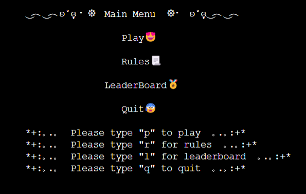

* There is a working leaderboard inside the game, well 3 different leaderboards! You can choose if you want to see the ranking of games with 5, 10 or 15 rounds!
---
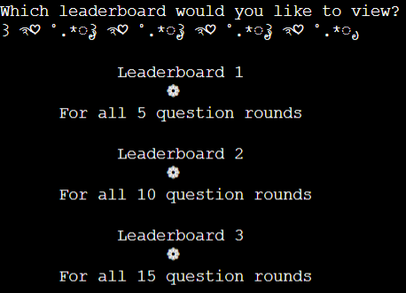

* The leaderboard in the game is equipt with fun emoticons and text decoration. Along with that there are delays in printing out the leaderboard to rake up suspense, these pauses cannot be captured in a screenshot so you will just have to play the quiz!
---
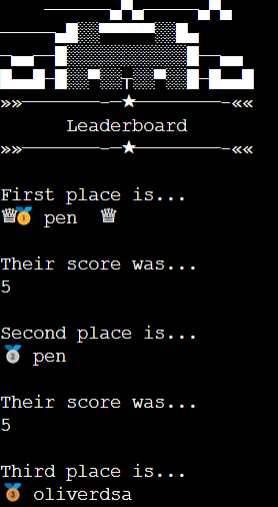

* Dunder Mifflin also has its own set of rules equipt with cute text decoration!
---

* Inside the quiz it will enable you to choose a username!
---
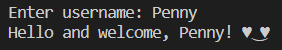

* The quiz enables you to choose how many questions you would like
---

* Along with that the questions are randomized, therefore players will not recieve the same question inside the same quiz. As well as that when the game is next played there will be a variety of questions available!
---

### Testing
---
#### Python Validators
* I ran my run.py file code through this validator [Pep8 validator](https://pep8ci.herokuapp.com/#)
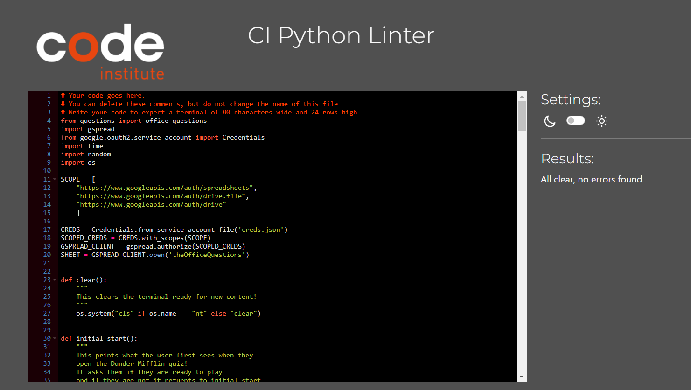

* I ran my questions.py file code through this validator [Pep8 validator](https://pep8ci.herokuapp.com/#)
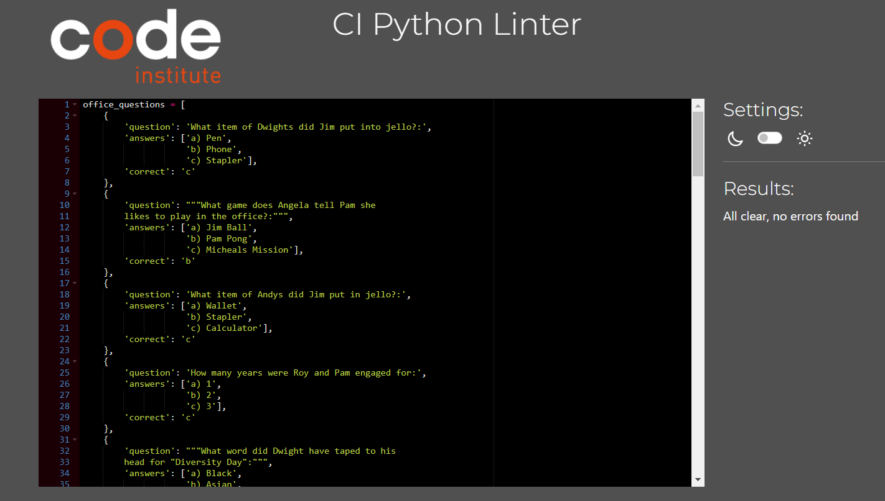

#### Javascript Validators
* I ran the index.js file code through this validator [Javascript Hint](https://jshint.com./)
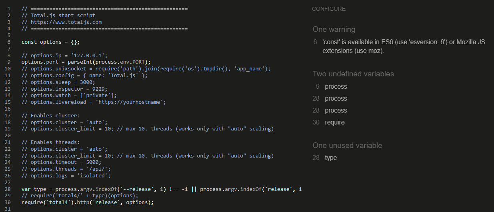

* I ran the default.js file code through this validator [Javascript Hint](https://jshint.com)
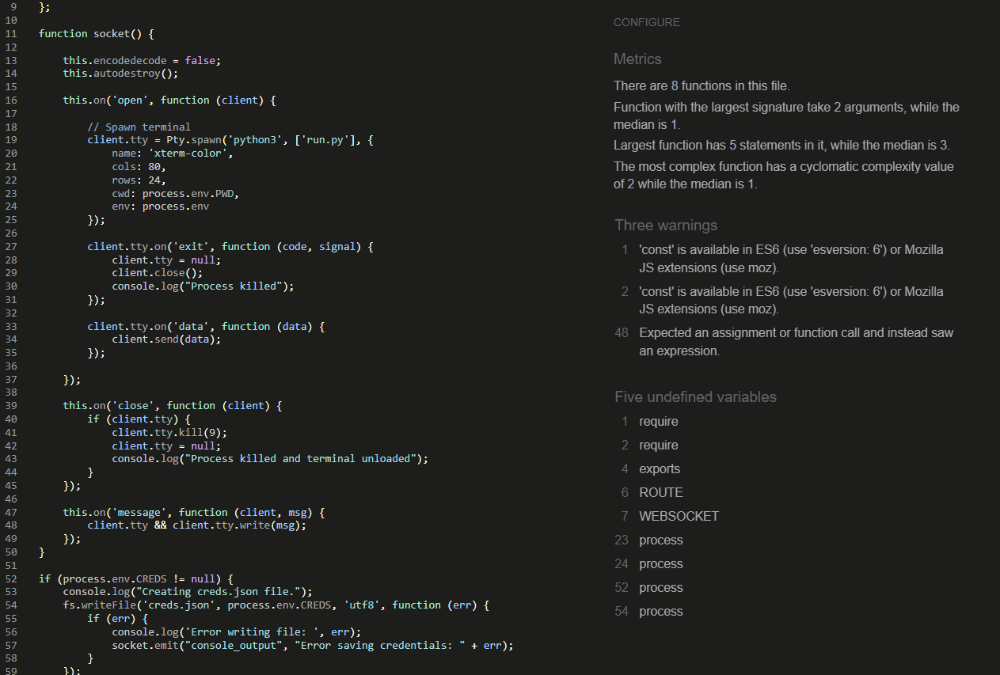

* I have noticed that this code has errors however these are the files provided by the code institute project 3 template and not my code.

#### HTML Validators
* I ran the index.html file code through this validator [W3 Validator](https://validator.w3.org/)

* I ran the layout.html file code through this validator [W3 Validator](https://validator.w3.org/)
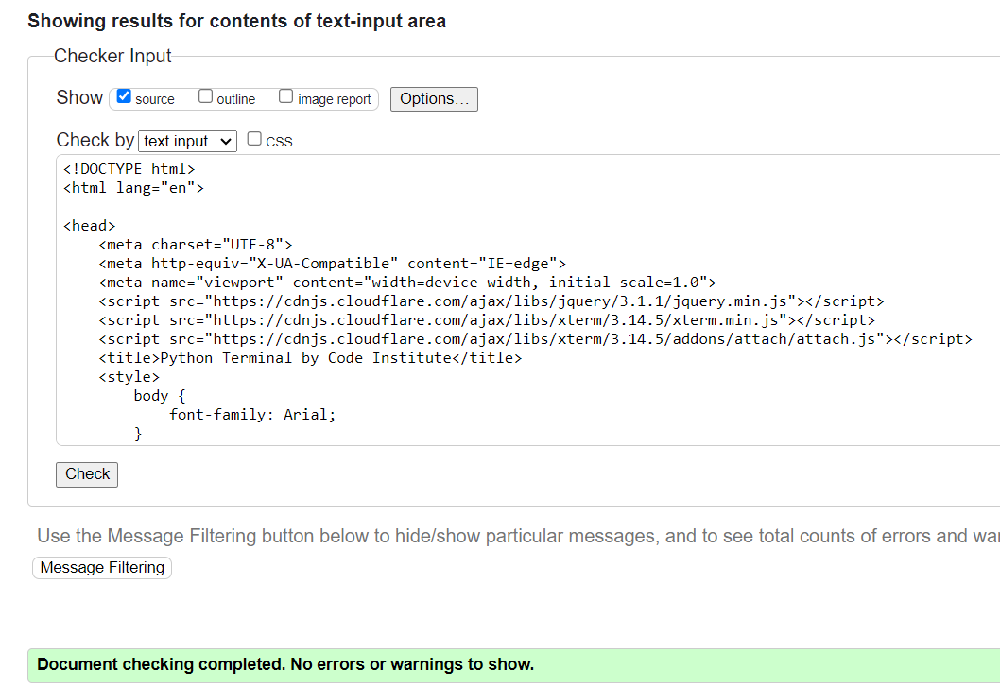

* I have noticed that this code has errors however these are the files provided by the code institute project 3 template and not my code.

* Test case 1
* Testing the initial start input
---
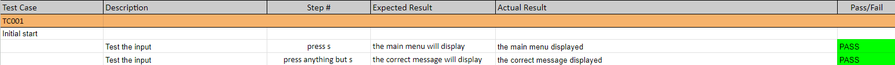

* Test case 2 
* Testing the input of the main menu, such as r displaying rules, q displaying the initial start and p displaying the quiz. Along with that when a button besides r, q, or p the message the computer displays explaining why it is not acceptable.
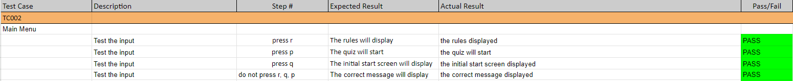

* Test case 3
* Testing the input of the question selection button, making sure that the answer is one of 5, 10, or 15. When the answer is invalid that the correct response displays.
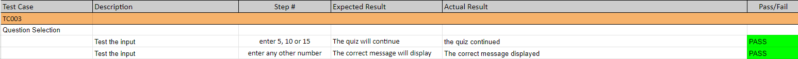

* Test case 4 
* Testing the input to ensure the username is longer than 2 letters, ensuring that when the insufficient amount of characters are inputted the computer prints out the correct response.

* Test case 5
* Testing the input, entered a, b or c to test whether the answer was right or wrong, along with if a, b or c was not entered and it was something random that the computer responds appropriately.
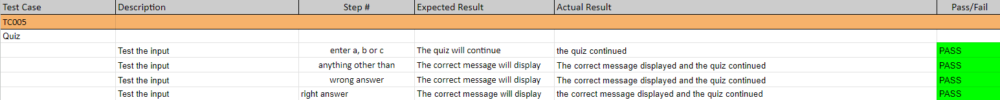

* Test case 6
* Testing the input, ensuring that the correct leaderboard will be displayed depending on whether the player enter 5, 10 or 15.
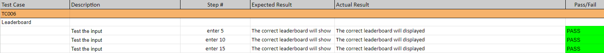

* Test case 7 
* Testing the input, checking that the correct message is displayed when the wrong input is entered.
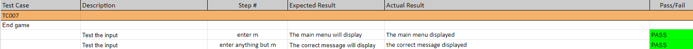

### Notable Bugs
* While playing the quiz I noticed that when the answer was right it would repeat the same question again, however when the question was wrong it would then change and display a new question, at first I believed there was something wrong in the logic where it decided if a question answer was right or wrong... It turned out to be that I was only incrementing i when the question was wrong and not when the question was right.

### Deployment
The site was deployed via Heroku, and the live link can be found here - [MY QUIZ]()
The project was developed utilizing a Code Institute provided template. During the development of the project, the template was updated to increase functionality. I switched over to the new template mid-project which you can see within the commit history. Some of the deployment steps below are specifically required for the new CI template and may not apply to older versions, or different projects.
Project Deployment
To deploy the project through Heroku I followed these steps:
* Sign up / Log in to Heroku
* From the main Heroku Dashboard page select 'New' and then 'Create New App'
* Give the project a name - I entered Aston_Martin_Quiz and select a suitable region, then selected create app. The name of the app must be unique.
* This will create the app within Heroku and bring you to the deploy tab. From the submenu at the top, navigate to the settings tab.
* This next step is required for creating the app when using the CI Python Deployment Template. If you created your own program without using the CI Template, you might not need to add a config var.
* In the config vars section selects the reveal config vars button. This will display the current config vars for the app, there should be nothing already there.
* In the KEY input field input PORT all in capitals, then in the VALUE field input 8000 and select the Add button to the right.
* Next select the add buildpack button below the config vars section.
* In the pop-up window select Python as your first build pack and select save changes.
* Then repeat the steps to add a node.js buildpack.
* The order of the buildpacks is important, in the list Python should be first with Node.js second. If they are not in this order, you can click and drag them to rearrange.
* Next navigate back to the deploy tab using the submenu at the top of the page.
* In the deployment method section select the GitHub - Connect to GitHub button and follow the steps prompted if any to connect your GitHub account
* In the Connect to GitHub section that appears, select the correct account, and enter the name of the repository, and select search.
* Once Heroku has located the repo select connect.
* This will connect the repo to the app within Heroku. Below the Apps Connected to Heroku section will be the Automatic Deploys section.
* In this section, confirm the correct branch of the repo is selected in the drop-down box, and then click the Enable Automatic Deploys button
* This will ensure whenever you change something in the repo and push the changes to GitHub, Heroku will rebuild the app. If you prefer to do this manually you can utilize the manual deployment options further down. For this project, I utilized the Automatic Deployment to enable me to check changes I made to the app as I developed it.
* Heroku will now build the app for you. Once it has completed the build process you will see a 'Your App Was Successfully Deployed' message and a link to the app to visit the live site.
* There is then a link to run it in the heroku site which opens the game into a new separate tab.

Once in the file, Because I am including packages in the requirements.txt file. you must also do the following:

1: how to download just the packages required for this project (pip3 install -r requirements.txt)
and
2: how to freeze the commands for a local copy of this project on their own account (pip3 freeze --local > requirements.txt)

### Credits 

### Content

* The text for all pages was created by myself.
* The reference material on python provided by [w3schools.com](https://www.w3schools.com/)

### Media
* The Favicon, links and meta code were generated by [Realfavicongenerator.net](https://realfavicongenerator.net).
* The text art, all of the cute art and little faces were generated by [Messletters](https://www.messletters.com/en/text-art/)

### Acknowledgements

* I'd like to thank the following:
- Matt Bodden, for the significant ideas for my project - your guidance truly made a difference!
- Oliver Train, for all his help regarding his patience and pointing me in the right direction.
- Dario Carrasquel, for all his help during this project as my mentor.